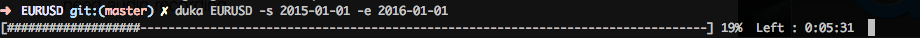
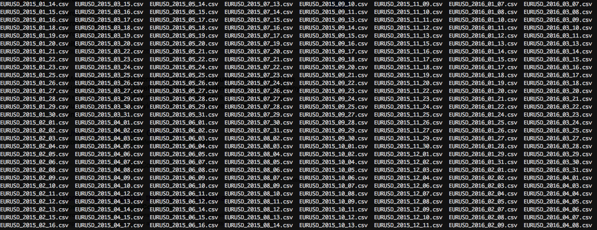

# duka - Dukascopy data downloader

Finding good Forex data is difficult or expensive. Dukascopy has made available an excellent [web tool](https://www.dukascopy.com/swiss/english/marketwatch/historical/) to download tick data for a large a variety of 
Forex, CFD and commodities. This is awesome and extremely useful for people, like me, trying to study the forex market. 
However, it takes a lot of time to download a large data set from the website because you can download only one day per time. In order to solve this issue, I created `duka`.  `duka` is a small terminal application which download ticks for a given date range from the Dukascopy historical repo and saves it in CSV.  `duka` takes advantage of python threads and coroutine in order to speed up the download. It takes roughly 10m to download tick data for  one year for a given instrument. No bad :) 

This is what `dukas looks like:



As you can see, `duka` estimates the remaing time until the download is complete. This is extremelly useful when downloading a large data set. 

This is what the resulting folder may look like: 



-----------------

Found a bug? Missing a feature? Open a issue and I will try to fix it as soon as possible. Pull request are also welcomed. :) 

## Installation

`duka` requires python 3.5 and aiohttp 0.21.5. It can be installed using `pip` as follows:

```
pip install duka
```

## Usage

- Help

   ```
   duka -h
   ```
- Download last available tick set (i.e. yesterday if not Saturday ) for `EURUSD` and `GBPUSD` 

  ```
  duka EURUSD GBPUSD 
  ```
- Download ticks for the `EURUSD` for a specific day

  ``` 
  duka EURUSD -d 2016-02-02
  ```
- Download ticks for the `EURUSD` between two dates. For example:

  ```
  duka EURUSD -s 2015-01-01 -e 2016-12-31 
  ```
  download all ticks for the 2015 year

- We can specify only the start date. The default end date will be today. For example:   
  
  ```
  duka EURUSD -s 2016-01-01
  ```
  downloads all ticks from the beginning of the year until now. 

All data is saved in the current folder. You can also specify the number of threads to be used by setting the `t` option. I recomand not to use too many threads because you might encounter problems opening too many connection to the server. 


